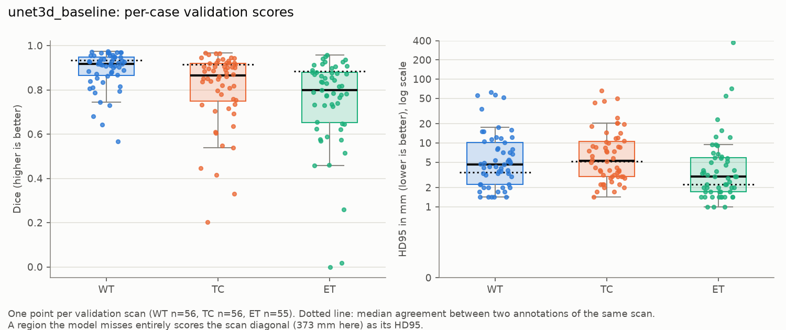
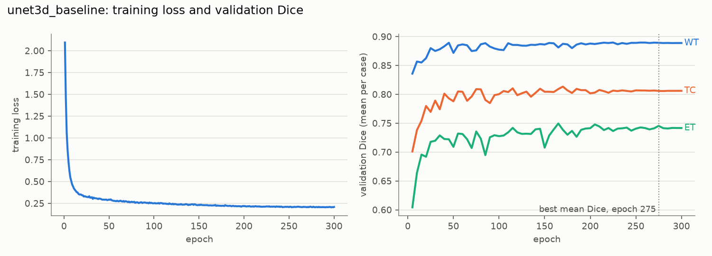
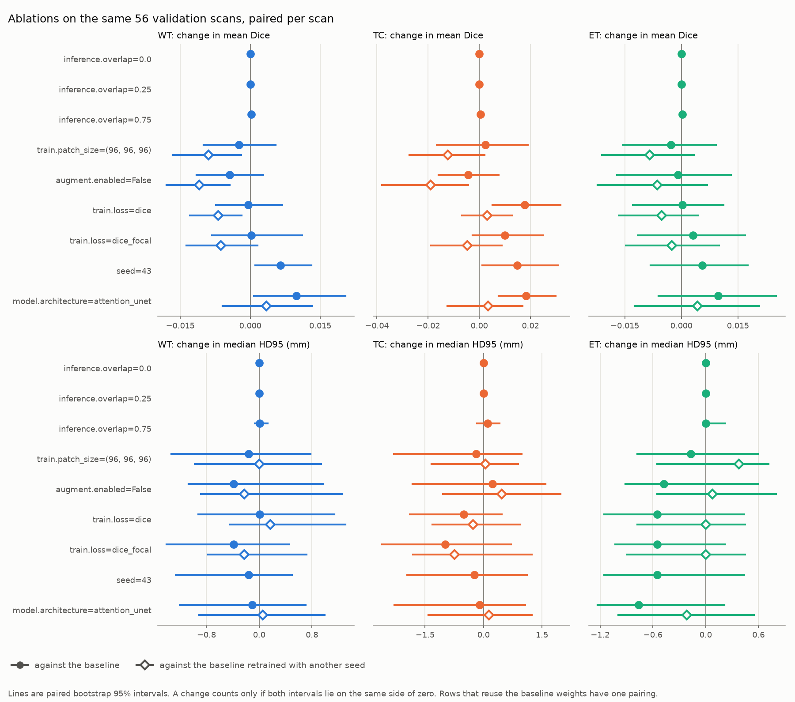

# BrainTumorSeg-3D

Volumetric brain tumour segmentation from multi-sequence MRI (FLAIR, T1w, T1gd, T2w) on the
Medical Segmentation Decathlon brain tumour task. The point of this repository is evaluation
discipline, not architectural novelty: strictly patient-level train/validation/test splits, a test
split that is evaluated exactly once, Dice and HD95 reported per tumour region as full per-case
distributions rather than single means, sliding-window inference, and an explicit analysis of where
the model fails, small lesions in particular.

> **Not a medical device.** This is a research artefact. It has not been clinically validated, it
> must not be used to inform diagnosis or treatment, and its outputs are not diagnoses.

## Results

Validation only so far. The test split has not been evaluated; it will be scored once, after the
configuration is frozen.

### Baseline 3D U-Net on the validation split

[`configs/unet3d.yaml`](configs/unet3d.yaml) trains a MONAI U-Net on 128³ patches with Dice +
cross-entropy, AdamW, a cosine schedule and mixed precision, for 300 epochs. It keeps the checkpoint
with the best mean validation Dice (epoch 275). Scores are for the 56 unique validation scans:
[`reports/baseline_results.csv`](reports/baseline_results.csv) holds the distributions and
[`reports/baseline_val_cases.csv`](reports/baseline_val_cases.csv) one row per scan.

| region | metric | n | mean ± std | median | IQR | min | max |
|---|---|---:|---|---:|---|---:|---:|
| WT | Dice | 56 | 0.889 ± 0.086 | 0.917 | 0.865–0.948 | 0.566 | 0.974 |
| TC | Dice | 56 | 0.806 ± 0.168 | 0.866 | 0.748–0.920 | 0.204 | 0.967 |
| ET | Dice | 55 | 0.745 ± 0.206 | 0.800 | 0.652–0.879 | 0.000 | 0.958 |
| WT | HD95 (mm) | 56 | 9.81 ± 14.32 | 4.63 | 2.24–10.23 | 1.41 | 62.61 |
| TC | HD95 (mm) | 56 | 10.12 ± 12.94 | 5.29 | 3.00–10.51 | 1.41 | 66.06 |
| ET | HD95 (mm) | 55 | 13.05 ± 50.85 | 3.00 | 1.73–5.82 | 1.00 | 373.13 |

ET is undefined for the one validation scan with no enhancing tumour; the model correctly predicted
none there.

- **The mean hides the failures.** One scan's enhancing tumour is missed completely: Dice 0, and an
  HD95 of 373.13 mm, the scan diagonal. That single case pulls the ET HD95 mean to 13.05 mm, while
  the median is 3.00 mm.
- **Small lesions fail.** The three lowest ET Dice scores (0.000, 0.018 and 0.259) belong to the
  three smallest enhancing lesions in the validation split (0.35, 0.32 and 0.03 mL). The test-set
  failure analysis will quantify this.
- **Against the human reference** (two annotations of the same scan, measured on the 114
  duplicated scans rather than these), median Dice is 0.917 vs 0.933 for WT, 0.866 vs 0.915 for TC,
  and 0.800 vs 0.883 for ET. The gap is smallest for whole tumour.
- **Training converged.** Over the last eight validations (epochs 265–300), mean validation Dice
  stayed between 0.8115 and 0.8135
  ([`reports/baseline_history.csv`](reports/baseline_history.csv)).





### Ablations

Each ablation changes one setting of the baseline and is scored on the same 56 validation scans
([`reports/ablations.csv`](reports/ablations.csv), full distributions in
[`reports/results.csv`](reports/results.csv)). The table gives mean Dice.

| change | WT | TC | ET | training | verdict |
|---|---:|---:|---:|---:|---|
| baseline | 0.889 | 0.806 | 0.745 | 1.09 h | |
| baseline, another training seed | 0.896 | 0.821 | 0.751 | 1.04 h | the seed-to-seed spread |
| loss: Dice only | 0.889 | 0.824 | 0.746 | 1.04 h | not robust to the baseline seed |
| loss: Dice + focal | 0.890 | 0.816 | 0.748 | 1.11 h | no detectable difference |
| patch 96³ | 0.887 | 0.808 | 0.743 | 0.70 h | not robust to the baseline seed |
| Attention U-Net | 0.899 | 0.824 | 0.755 | 4.82 h | not robust to the baseline seed |
| augmentation off | 0.885 | 0.802 | 0.744 | 1.01 h | not robust to the baseline seed |
| overlap 0 or 0.25 | 0.889 | 0.806 | 0.745 | none | identical to the baseline |
| overlap 0.75 | 0.890 | 0.806 | 0.746 | none | no detectable difference |

**No ablation is better or worse than the baseline.** A change counts only if its paired
bootstrap interval excludes zero against both baseline runs, on the same side, and none does.

- **Retraining the baseline moves the score as much as any ablation.** With only the training
  seed changed, mean Dice moves by +0.007 (WT) and +0.015 (TC), and a bootstrap over scans calls
  both differences real. The interval covers which scans were sampled, not how training went.
- **A single-seed study would have reported two wins.** Dice-only loss and Attention U-Net each
  gain 0.018 on TC against the baseline, with intervals excluding zero. Against the reseeded
  baseline the gains are 0.003, and Attention U-Net costs more than four times the training.
- **Overlap is inert here.** The brain crops are barely larger than the 128-voxel window, so
  overlap 0, 0.25 and 0.5 place the same windows and give identical scores.
- **The baseline is the configuration carried forward to the test split.**

"Not robust to the baseline seed" means the change differs from one baseline run but not the
other on at least one region. The full account is in [`DECISIONS.md`](DECISIONS.md).



## Data

484 labelled cases from MSD Task01_BrainTumour (BraTS-derived), each a co-registered 240 x 240 x 155
volume at 1 mm isotropic spacing with four sequences. Labels are oedema, non-enhancing tumour and
enhancing tumour, evaluated as the BraTS regions WT, TC and ET. Enhancing tumour is absent in 12
cases, so ET Dice is undefined for them. Per-case statistics are in
[`reports/dataset_stats.csv`](reports/dataset_stats.csv) and the summary in
[`reports/dataset_summary.md`](reports/dataset_summary.md).

**Case ids are not patients.** MSD has no patient identifiers, and the same patient appears under
several case ids. 228 cases are exact image duplicates of another case (in 108 of the 114 pairs
with a different label map), and further cases are repeat scans of one patient at different
timepoints. A case-level random split would leave 42 of 73 test cases with a scan of the same
patient in the training set. Cases are therefore linked by image similarity in the shared atlas
space, and the split is made over the 129 linked patient groups plus the unlinked cases:
342 / 71 / 71 cases for train / validation / test, committed in
[`configs/splits.json`](configs/splits.json). The reasoning and the threshold evidence are in
[`DECISIONS.md`](DECISIONS.md).


## Evaluation protocol

- **Metrics:** Dice and HD95 (mm) per region, reported as distributions: n, mean, std, median,
  quartiles, min and max across cases. HD95 is the symmetric 95th-percentile surface distance.
  Both are verified against hand-computed cases and against MONAI on real label pairs
  (`make crosscheck`, [`reports/metric_crosscheck.csv`](reports/metric_crosscheck.csv)).
- **Empty ground truth:** when a region is absent, Dice and HD95 are undefined. Those cases are
  counted rather than averaged, and scored as detection (was tumour predicted where there is
  none?). When a region is present but missed, the case scores Dice 0 and an HD95 of the scan
  diagonal (373.13 mm), and is never dropped.
- **Duplicated scans** are scored once, so validation has 56 unique scans and test has 52.
- **Human reference:** MSD ships 114 scans twice, each copy with its own label map. Scoring the
  two label maps of each scan against each other shows how far annotations of an identical image
  disagree ([`reports/annotation_agreement_summary.csv`](reports/annotation_agreement_summary.csv)):

| region | Dice median (IQR) | Dice min | HD95 median (IQR), mm |
|---|---|---|---|
| WT | 0.933 (0.899–0.956) | 0.712 | 3.46 (2.24–5.79) |
| TC | 0.915 (0.833–0.949) | 0.361 | 5.15 (2.00–10.41) |
| ET | 0.883 (0.830–0.927) | 0.426 | 2.24 (1.41–3.46) |

The full rules and the reasoning behind them are in [`DECISIONS.md`](DECISIONS.md).

## Setup

Requirements: [uv](https://docs.astral.sh/uv/), GNU Make, and for training an NVIDIA GPU with a
CUDA 12.x capable driver (developed on an RTX 3090, 24 GB).

```bash
make setup
```

This creates `.venv` with Python 3.11, installs the pinned dependencies with the CUDA 12.6 build of
PyTorch, and prints the torch and MONAI versions and the detected GPU. On a machine without an
NVIDIA GPU use `make setup TORCH_BACKEND=cpu`.

Data: download `Task01_BrainTumour` from the [Medical Segmentation Decathlon](http://medicaldecathlon.com/)
and extract it so that `data/raw/Task01_BrainTumour/` contains `dataset.json`, `imagesTr/` and
`labelsTr/`. The data is licensed CC-BY-SA 4.0 and is not redistributed here.

## Usage

```bash
make data
```

This preprocesses every labelled case once into `data/processed/`: crop to the brain, per-case
per-channel z-score inside the brain mask, float16 cache. It then links repeat scans, checks that
`configs/splits.json` is exactly the split the config produces, and writes the dataset statistics,
figures and annotation-agreement reference to `reports/`. The first run decompresses about 7 GB of
NIfTI on a single CPU core and takes minutes; later runs reuse the cache.

```bash
make crosscheck
```

This rechecks `metrics.py` against MONAI's independent Dice and HD95 on real label pairs, and fails
if they disagree.

```bash
make train
make eval
make ablate
make report
```

`make train` trains the config (default `configs/unet3d.yaml`, or pass `CONFIG=...`) into
`runs/<name>/`. It keeps the checkpoint with the best validation Dice, and rerunning it resumes an
interrupted run. On an RTX 3090 the baseline takes about an hour. `make eval` scores that
checkpoint on the validation split with the full metrics; the command line refuses the test
split until the configuration is frozen. `make ablate` trains and scores every config in
`configs/ablations/`, each of which changes one setting of the baseline; it takes about ten
hours in total and skips runs that are already finished. `make report` writes the tables and
figures in `reports/`, and needs the baseline and all ablations to have been evaluated. Every run
is logged to a local MLflow store in `mlruns/`, including the config, seed, per-epoch metrics, git
commit and run directory. To browse it:

```bash
.venv/Scripts/mlflow ui --backend-store-uri sqlite:///mlruns/mlflow.db
```

(On Linux or macOS the executable is `.venv/bin/mlflow`.)

## License

Code is released under the MIT License, see [LICENSE](LICENSE).
