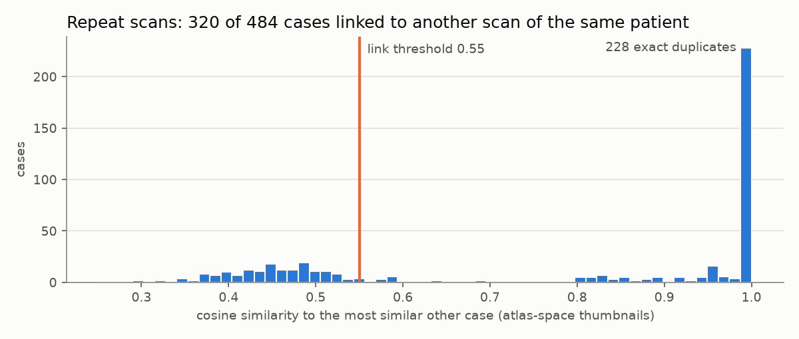
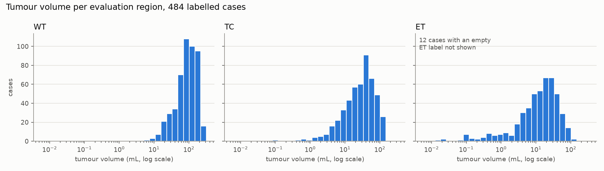

# BrainTumorSeg-3D

Volumetric brain tumour segmentation from multi-sequence MRI (FLAIR, T1w, T1gd, T2w) on the
Medical Segmentation Decathlon brain tumour task. The point of this repository is evaluation
discipline, not architectural novelty: strictly patient-level train/validation/test splits, a test
split that is evaluated exactly once, Dice and HD95 reported per tumour region as full per-case
distributions rather than single means, sliding-window inference, and an explicit analysis of where
the model fails, small lesions in particular.

> **Not a medical device.** This is a research artefact. It has not been clinically validated, it
> must not be used to inform diagnosis or treatment, and its outputs are not diagnoses.

## Results

TBD. No model has been trained yet. Every number that appears here will be produced by a script in
this repository and written to `reports/`.

## Data

484 labelled cases from MSD Task01_BrainTumour (BraTS-derived), each a co-registered 240 x 240 x 155
volume at 1 mm isotropic spacing with four sequences. Labels are oedema, non-enhancing tumour and
enhancing tumour, evaluated as the BraTS regions WT, TC and ET. Enhancing tumour is absent in 12
cases, so ET Dice is undefined for them. Per-case statistics are in
[`reports/dataset_stats.csv`](reports/dataset_stats.csv) and the summary in
[`reports/dataset_summary.md`](reports/dataset_summary.md).

**Case ids are not patients.** MSD has no patient identifiers, and the same patient appears under
several case ids. 228 cases are exact image duplicates of another case (in 108 of the 114 pairs
with a different label map), and further cases are repeat scans of one patient at different
timepoints. A case-level random split would leave 42 of 73 test cases with a scan of the same
patient in the training set. Cases are therefore linked by image similarity in the shared atlas
space, and the split is made over the 129 linked patient groups plus the unlinked cases:
342 / 71 / 71 cases for train / validation / test, committed in
[`configs/splits.json`](configs/splits.json). The reasoning and the threshold evidence are in
[`DECISIONS.md`](DECISIONS.md).





## Evaluation protocol

- **Metrics:** Dice and HD95 (mm) per region, reported as distributions: n, mean, std, median,
  quartiles, min and max across cases. HD95 is the symmetric 95th-percentile surface distance.
  Both are verified against hand-computed cases and against MONAI on real label pairs
  (`make crosscheck`, [`reports/metric_crosscheck.csv`](reports/metric_crosscheck.csv)).
- **Empty ground truth:** when a region is absent, Dice and HD95 are undefined. Those cases are
  counted rather than averaged, and scored as detection (was tumour predicted where there is
  none?). When a region is present but missed, the case scores Dice 0 and an HD95 of the scan
  diagonal (373.13 mm), and is never dropped.
- **Duplicated scans** are scored once, so validation has 56 unique scans and test has 52.
- **Human reference:** MSD ships 114 scans twice, each copy with its own label map. Scoring the
  two label maps of each scan against each other shows how far annotations of an identical image
  disagree ([`reports/annotation_agreement_summary.csv`](reports/annotation_agreement_summary.csv)):

| region | Dice median (IQR) | Dice min | HD95 median (IQR), mm |
|---|---|---|---|
| WT | 0.933 (0.899–0.956) | 0.712 | 3.46 (2.24–5.79) |
| TC | 0.915 (0.833–0.949) | 0.361 | 5.15 (2.00–10.41) |
| ET | 0.883 (0.830–0.927) | 0.426 | 2.24 (1.41–3.46) |

The full rules and the reasoning behind them are in [`DECISIONS.md`](DECISIONS.md).

## Setup

Requirements: [uv](https://docs.astral.sh/uv/), GNU Make, and for training an NVIDIA GPU with a
CUDA 12.x capable driver (developed on an RTX 3090, 24 GB).

```bash
make setup
```

This creates `.venv` with Python 3.11, installs the pinned dependencies with the CUDA 12.6 build of
PyTorch, and prints the torch and MONAI versions and the detected GPU. On a machine without an
NVIDIA GPU use `make setup TORCH_BACKEND=cpu`.

Data: download `Task01_BrainTumour` from the [Medical Segmentation Decathlon](http://medicaldecathlon.com/)
and extract it so that `data/raw/Task01_BrainTumour/` contains `dataset.json`, `imagesTr/` and
`labelsTr/`. The data is licensed CC-BY-SA 4.0 and is not redistributed here.

## Usage

```bash
make data
```

This preprocesses every labelled case once into `data/processed/`: crop to the brain, per-case
per-channel z-score inside the brain mask, float16 cache. It then links repeat scans, checks that
`configs/splits.json` is exactly the split the config produces, and writes the dataset statistics,
figures and annotation-agreement reference to `reports/`. The first run decompresses about 7 GB of
NIfTI on a single CPU core and takes minutes; later runs reuse the cache.

```bash
make crosscheck
```

This rechecks `metrics.py` against MONAI's independent Dice and HD95 on real label pairs, and fails
if they disagree.

`make lint` and `make test` work now. `make train`, `make eval` and `make report` are wired to the
command-line entrypoint and are filled in as the pipeline is built.

## License

Code is released under the MIT License, see [LICENSE](LICENSE).
