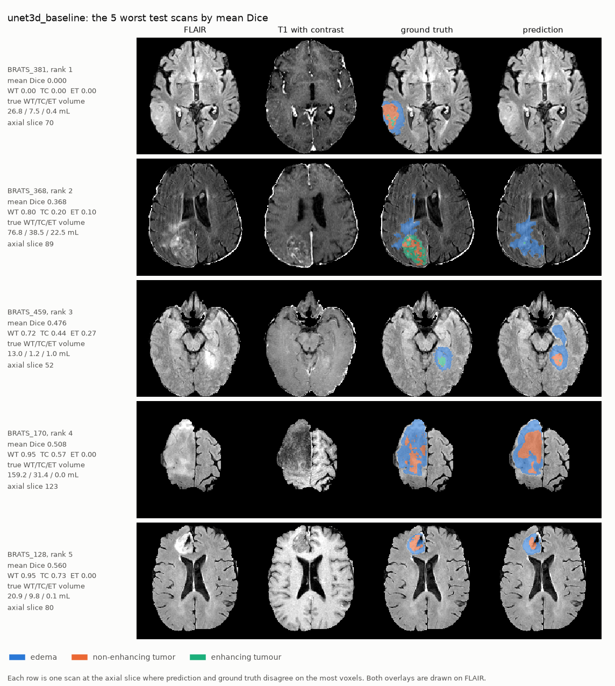
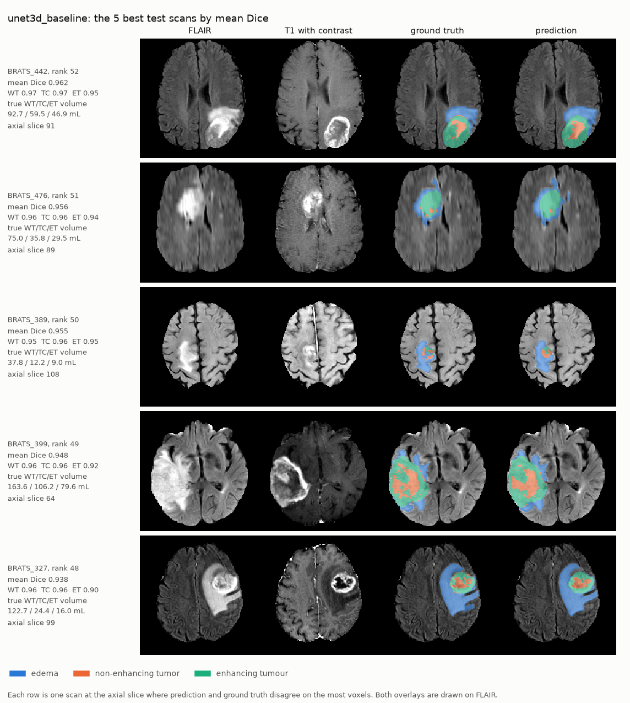
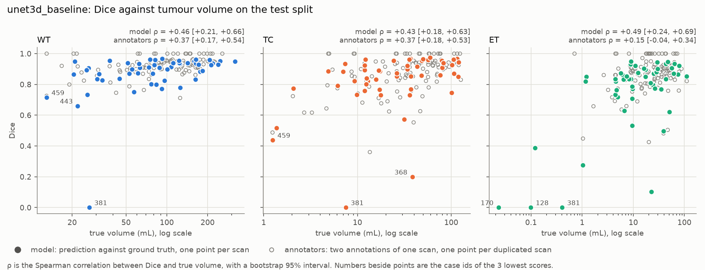

# Failure analysis on the test split

The frozen configuration ([`configs/unet3d.yaml`](../configs/unet3d.yaml), epoch-275 checkpoint)
was scored once on the 52 unique test scans. This document describes what goes wrong on them.
Every number comes from a table written by `make report`:

| file | contents |
|---|---|
| [`test_results.csv`](test_results.csv), [`test_cases.csv`](test_cases.csv) | score distributions, and one row per scan |
| [`test_failure_cases.csv`](test_failure_cases.csv) | scans ranked by mean Dice, with error volumes and lesion intensities |
| [`test_correlations.csv`](test_correlations.csv) | Spearman correlations of the scores with lesion volume and intensity |
| [`test_dice_by_volume.csv`](test_dice_by_volume.csv) | scores within quartiles of lesion volume |
| [`test_confusion.csv`](test_confusion.csv) | voxel confusion between labels, for the model and between annotators |
| `val_*.csv` | the same four tables on the validation split, used below as a second sample |

"Annotators" always means the 114 scans the dataset holds twice with two label maps, scored one
against the other. They are the reference for how much a second human reader would disagree.

## Summary

- **Most scans are segmented close to annotator agreement; a few fail badly.** Median Dice is
  0.908 / 0.872 / 0.835 (WT / TC / ET) against 0.933 / 0.915 / 0.883 between annotators. The means
  are lower, 0.870 / 0.824 / 0.744, because 1, 3 and 7 scans score below 0.5.
- **Small lesions are the most consistent failure.** The quarter of scans with the smallest
  lesions accounts for 44% (WT), 40% (TC) and 45% (ET) of all the Dice lost, where an even spread
  would give 25%. Dice correlates with lesion volume at ρ = 0.46, 0.43 and 0.49. Every enhancing
  tumour under 1.1 mL scores below 0.4.
- **They are not the worst failure.** The two lowest-ranked scans have tumours of 26.8 mL and
  76.8 mL. What they share is a lesion that barely stands out: one tumour is the darkest of the
  split on T2w and FLAIR and is missed completely, the other enhances so weakly that its core is
  labelled as oedema.
- **Faint lesions fail at any size.** ET Dice correlates with the T1gd intensity of the enhancing
  tumour at ρ = 0.67 on test and 0.50 on validation. Between annotators it is 0.08: a faint
  enhancing tumour is hard for the model and not for a human reader.
- **Large HD95 values are detection errors, not boundary errors.** All 9 scans with at least 1 mL
  of tumour predicted apart from any true tumour, or of true tumour left untouched, have a WT
  HD95 above 20 mm. Only 1 of the other 43 does.

## The scores

| region | metric | n | mean ± std | median | IQR | min | max |
|---|---|---:|---|---:|---|---:|---:|
| WT | Dice | 52 | 0.870 ± 0.143 | 0.908 | 0.836–0.940 | 0.000 | 0.967 |
| TC | Dice | 52 | 0.824 ± 0.185 | 0.872 | 0.788–0.935 | 0.000 | 0.974 |
| ET | Dice | 51 | 0.744 ± 0.253 | 0.835 | 0.748–0.883 | 0.000 | 0.949 |
| WT | HD95 (mm) | 52 | 12.84 ± 19.96 | 4.47 | 3.00–10.81 | 1.41 | 93.60 |
| TC | HD95 (mm) | 52 | 15.06 ± 51.79 | 4.36 | 2.18–8.56 | 1.00 | 373.13 |
| ET | HD95 (mm) | 51 | 20.92 ± 72.47 | 2.45 | 1.87–6.49 | 1.00 | 373.13 |

One test scan has no enhancing tumour, and the model predicts none there. A single scan at Dice 0
moves a mean over 52 scans a long way: without BRATS_381 the WT mean would be
52 × 0.870 / 51 = 0.887. The median does not move, which is why both are reported.

## The five worst and the five best scans

Scans are ranked by their mean Dice over the regions present in the ground truth.

| rank | scan | WT / TC / ET Dice | true WT / TC / ET volume (mL) | what happened |
|---:|---|---|---|---|
| 1 | BRATS_381 | 0.00 / 0.00 / 0.00 | 26.8 / 7.5 / 0.4 | Tumour missed completely. The model predicts 1.5 mL of tumour, all of it elsewhere. |
| 2 | BRATS_368 | 0.80 / 0.20 / 0.10 | 76.8 / 38.5 / 22.5 | Tumour found, core labelled as oedema: 8.1 mL of core and 4.7 mL of enhancing tumour predicted. |
| 3 | BRATS_459 | 0.72 / 0.44 / 0.27 | 13.0 / 1.2 / 1.0 | Small tumour, over-segmented: 21.3 mL of tumour and 3.7 mL of core predicted against 13.0 mL and 1.2 mL. |
| 4 | BRATS_170 | 0.95 / 0.57 / 0.00 | 159.2 / 31.4 / 0.02 | Whole tumour right. The enhancing tumour is 23 voxels; the 93 predicted miss all of them. |
| 5 | BRATS_128 | 0.95 / 0.73 / 0.00 | 20.9 / 9.8 / 0.1 | Whole tumour right. The 0.1 mL of enhancing tumour is not predicted at all. |

Three of the five are small-lesion failures, two of them on scans whose whole tumour is
segmented well. The two worst are something else, taken up below.

The best five (mean Dice 0.938–0.962) all have an enhancing tumour brighter on T1gd than the
split median (2.12–3.17 against 1.90). They are not all large: BRATS_389 has a whole tumour of
37.8 mL and sits in the smallest quarter of the split.

## Small lesions

Spearman correlation between Dice and the true volume of the region, with a bootstrap 95%
interval over scans:

| | WT | TC | ET |
|---|---|---|---|
| model, test (52 scans) | 0.46 [0.21, 0.66] | 0.43 [0.18, 0.63] | 0.49 [0.24, 0.69] |
| model, validation (56 scans) | 0.69 [0.53, 0.81] | 0.44 [0.20, 0.64] | 0.61 [0.37, 0.79] |
| annotators (114 scans) | 0.37 [0.17, 0.54] | 0.37 [0.18, 0.53] | 0.15 [−0.04, 0.34] |

Dice within quartiles of true volume on the test split:

| region | volume quartile (mL) | mean Dice | median Dice | min Dice | share of lost Dice |
|---|---|---:|---:|---:|---:|
| WT | 13.0–44.6 | 0.772 | 0.836 | 0.000 | 44% |
| WT | 51.3–82.0 | 0.893 | 0.909 | 0.750 | 21% |
| WT | 83.6–142.1 | 0.890 | 0.915 | 0.770 | 21% |
| WT | 159.2–318.3 | 0.926 | 0.936 | 0.832 | 14% |
| TC | 1.2–12.0 | 0.719 | 0.793 | 0.000 | 40% |
| TC | 12.2–31.4 | 0.829 | 0.840 | 0.573 | 24% |
| TC | 34.0–56.6 | 0.842 | 0.915 | 0.199 | 22% |
| TC | 59.5–120.2 | 0.906 | 0.925 | 0.746 | 13% |
| ET | 0.02–5.7 | 0.544 | 0.732 | 0.000 | 45% |
| ET | 6.1–10.9 | 0.804 | 0.835 | 0.531 | 20% |
| ET | 12.3–29.5 | 0.799 | 0.873 | 0.104 | 19% |
| ET | 30.1–111.3 | 0.835 | 0.870 | 0.497 | 16% |

"Share of lost Dice" is the quartile's part of the sum of (1 − Dice) over the split. On the
validation split the smallest quartile holds 44%, 38% and 48%.

- **The effect is real and it repeats.** The interval excludes zero for every region on both
  splits, and the smallest quartile carries 38–48% of the lost Dice in all six cases.
- **Below about 1 mL the enhancing tumour is rarely found.** The five test scans with an
  enhancing tumour under 1.1 mL score ET Dice 0.00, 0.00, 0.39, 0.00 and 0.27. The next two, at
  1.17 and 1.21 mL, score 0.82 and 0.85. The four validation scans under 1.1 mL score 0.26, 0.02,
  0.00 and 0.59.
- **For WT and TC, part of this is Dice itself.** A boundary error of fixed width costs a small
  object more Dice. Two annotations of the same scan show a correlation of 0.37 for both regions,
  inside the model's intervals on the test split. HD95, which does not scale with object size,
  shows no detectable dependence on volume for WT (−0.19 [−0.44, 0.09]) or TC
  (−0.10 [−0.37, 0.18]).
- **For ET it goes beyond the metric.** Annotators show 0.15 with an interval spanning zero, the
  model 0.49, and the model's ET HD95 also worsens as the lesion shrinks (−0.35 [−0.57, −0.10]).

## Faint lesions

Volume does not explain the two worst scans, so after seeing them one more quantity was measured:
the mean normalised intensity of each MRI sequence inside each true region. Intensities are
z-scores within the brain, so 0 is the brightness of the average brain voxel. This was chosen
after the test results were seen. All twelve region and sequence pairs are therefore reported,
and the validation split, which played no part in choosing it, is shown next to the test split.

Spearman correlation between Dice and the mean intensity of the region, test / validation:

| region | FLAIR | T1w | T1gd | T2w |
|---|---|---|---|---|
| WT | 0.20 / 0.22 | −0.05 / 0.02 | 0.06 / 0.00 | **0.59 / 0.43** |
| TC | 0.42 / 0.18 | 0.05 / 0.02 | 0.56 / 0.22 | 0.27 / 0.09 |
| ET | 0.23 / −0.20 | −0.16 / −0.08 | **0.67 / 0.50** | 0.29 / 0.15 |

Two pairs have an interval excluding zero on both splits, shown in bold:

| | test | validation | annotators |
|---|---|---|---|
| ET Dice against T1gd intensity of the enhancing tumour | 0.67 [0.46, 0.81] | 0.50 [0.26, 0.69] | 0.08 [−0.13, 0.30] |
| WT Dice against T2w intensity of the whole tumour | 0.59 [0.39, 0.73] | 0.43 [0.17, 0.64] | 0.27 [0.07, 0.45] |

- **This is what the two worst scans have in common.** BRATS_381 has the darkest whole tumour of
  the test split on T2w (−0.08, where the median is 0.96) and on FLAIR (0.74 against 1.88): on
  T2w its tumour is no brighter than average brain. BRATS_368 has the fourth-faintest enhancing
  tumour of 51 (T1gd 0.80 against a median of 1.90).
- **The five faintest enhancing tumours all score poorly, and three of them are not small.**
  Their ET Dice is 0.53, 0.00, 0.62, 0.10 and 0.00, at volumes of 9.5, 0.4, 50.9, 22.5 and
  0.1 mL.
- **It repeats on validation.** There too the scan with the darkest tumour on T2w (−0.11) has
  the lowest WT Dice of the split (0.57), and the five faintest enhancing tumours score between
  0.46 and 0.74 where the median is 0.80.
- **It is a model weakness, not an ambiguity in the labels.** Annotator agreement on enhancing
  tumour does not depend on how strongly it enhances (0.08).
- **It is not just size in disguise.** Small lesions also tend to be fainter, so the two could
  be one effect. With volume held fixed, the partial correlation is still 0.56 on test and 0.42
  on validation for ET, and 0.45 and 0.17 for WT.
- **The tumour-core result does not repeat.** TC Dice against T1gd intensity is 0.56 on test and
  0.22 [−0.06, 0.49] on validation, so it is not claimed.

## Labels confused inside the tumour

Share of the voxels of each true label by what they were labelled as, pooled over the test
scans. The second number is the same share between the two annotations of the duplicated scans.

| true label | background | oedema | non-enhancing | enhancing |
|---|---|---|---|---|
| oedema | 14.8% / 8.1% | **79.5% / 86.2%** | 4.2% / 4.8% | 1.5% / 0.9% |
| non-enhancing tumour | 5.5% / 1.6% | 13.3% / 11.0% | **66.2% / 75.7%** | 14.9% / 11.7% |
| enhancing tumour | 4.2% / 1.5% | 4.6% / 5.3% | 7.3% / 7.8% | **83.9% / 85.5%** |

- **Non-enhancing tumour is the hardest label for both.** Annotators agree on 75.7% of it and
  the model recovers 66.2%. The errors go the same two ways: into oedema and into enhancing
  tumour. It is one reason TC scores below WT.
- **Between tumour labels the model confuses about what annotators do.** Every off-diagonal
  share among the three tumour labels is within 3.2 points of theirs. The larger gap is against
  background: the model leaves out 14.8% of the oedema, where annotators differ on 8.1%.
- **One scan shows the opposite error to BRATS_368.** In BRATS_404 the core is outlined
  correctly (TC Dice 0.97) but almost all of it is labelled enhancing: 113.6 mL predicted against
  39.0 mL, ET Dice 0.50.

## Large HD95 values

Ten test scans have a WT HD95 above 20 mm. In nine of them the cause is a whole component, not a
boundary: at least 1 mL of predicted tumour that touches no true tumour (seven scans, up to
38.0 mL in BRATS_477) or of true tumour that the prediction does not touch (three scans;
BRATS_381 is in both groups). No scan with a WT HD95 of 20 mm or less has either. The thresholds
of 20 mm and 1 mL are round numbers picked after looking at the table.

Two consequences:

- A scan can score well on Dice and badly on HD95. BRATS_392 has WT Dice 0.94 and WT HD95
  48.8 mm, from 2.4 mL of detached prediction. This is the error HD95 is reported to catch.
- Keeping only the largest predicted component would remove the detached predictions. It was not
  tried: the configuration was frozen before the test split was scored.

The ground truth itself is not one clean object. Across the test scans, the median number of
true tumour fragments the prediction does not touch is 15.5, and their median volume 0.05 mL.

## What this analysis cannot show

- **52 scans.** The intervals are wide, and a claim about one failure mode rests on a handful of
  scans. The test and validation correlations differ by as much as 0.2.
- **Correlation is not cause.** Lesion intensity was looked at because of two scans. It repeats
  on validation, but validation was used to pick the checkpoint and is not a fresh sample.
- **Volume and intensity are entangled.** The partial correlations separate them only roughly.
- **One training run.** The ablations showed that retraining with another seed moves mean Dice
  by up to 0.015. Which individual scans fail may depend on the seed as well.
- **One dataset.** Every scan is skull-stripped, co-registered and resampled the same way. None
  of this says how the model behaves on scans prepared differently.
